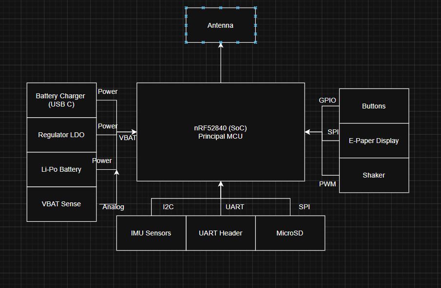

Diagrama proiectului:

  

| Component | Part Number | Package | Function | JLCPCB Part | Datasheet |
|-----------|------------|---------|----------|-------------|-----------|
| MCU | nRF52840-QIAA-R | aQFN73 (7x7) | Microcontroller + BLE + USB | C190794 | [Datasheet](https://docs.nordicsemi.com/) |
| Charger / Power Path | BQ25180YBGR | DSBGA-8 | Li-Ion/LiPo charger with power path | C3682423 | [Datasheet](https://www.ti.com/lit/ds/symlink/bq25180.pdf) |
| Buck-Boost Regulator | RT6160AWSC | WLCSP-15 | 3.3V system rail regulator | C7065276 | [Datasheet](https://www.richtek.com/assets/product_file/RT6160A/DS6160A-05.pdf) |
| Fuel Gauge | MAX17048G+T10 | DFN-8 (2x2) | Battery SOC monitoring | C2682616 | [Datasheet]([https://link-catre-pdf](https://www.analog.com/media/en/technical-documentation/data-sheets/MAX17048-MAX17049.pdf) |
| Accelerometer | BMA421 | LGA-12 (2x2) | Step counting + motion wake | C5242966 | [Datasheet]([https://link-catre-pdf](https://www.bosch-sensortec.com/media/boschsensortec/downloads/datasheets/bst-bma421-ds004.pdf) |
| Haptic Driver | DRV2605LDGSR | VSSOP-10 | ERM motor driver with effects library | C527464 | [Datasheet](https://www.ti.com/lit/ds/symlink/drv2605l.pdf) |
| PFET (EPD power) | SI2301CDS | SOT-23 | E-paper display power gating | C10487 | [Datasheet](https://jlcpcb.com/partdetail/Changjiang_Electronics_Tech_CJ-SI2301CDS/C10487) |
| USB ESD Protection | USBLC6-2SC6Y | SOT-23-6 | ESD protection on USB data lines | C7519 | [Datasheet](https://www.st.com/resource/en/datasheet/usblc6-2.pdf) |
